# WAPH-Web Application Programming and Hacking

## Instructor: Dr. Phu Phung

# Project Topic/Title : Mini Facebook - Team 16

# Team members

1. Sohan Chidvilas Bodapati, bodapass@mail.uc.edu
2. Maheedhar Atmakuru, atmakuma@mail.uc.edu
3. Bhanu Suraj Kurella, kurellbj@mail.uc.edu

# Project Management Information

Source code repository (private access): <https://github.com/waph-team16/waph-teamproject>

Project homepage (public): <https://waph-team16.github.io>

## Revision History

| Date       |   Version     |  Description |
|------------|:-------------:|-------------:|
| 24/03/2024 |  0.0          | Sprint-0 Updated|
| 31/03/2024 |  1.0          | Sprint-1 Updated|
| 18/03/2024 |  2.0          | Sprint-2 Updated|


# Overview

We've set up a database structure, with tables for users, posts and comments in Sprint 2. To ensure data integrity and efficient querying we've defined the relationships between these tables. Users can create posts. Each post can have several comments associated with it. For managing user information we've implemented CRUD operations for each table.
Logged in users now have the ability to post comments and posts. To simplify these actions we've designed user forms to logged in users. Additionally we've ensured that user sessions persist across pages offering a navigation experience, for logged in users.
Furthermore individuals who are logged in can. Delete their posts. We have introduced functions that allow users to make changes or delete their posts ensuring that only the original poster has these privileges. By restricting access, to editing and deleting posts and incorporating authentication measures we have enhanced security and privacy on the platform.
Overall these enhancements have elevated user satisfaction. Provided users, with the means to interact effectively with the platform.

# System Analysis

### Problem Definition:
The primary goal of the Facebook application is to provide a platform for individuals to interact and socialize. This involves simplifying the process of registering and logging in for users empowering them to manage their accounts allowing them to add or posts incorporating real time chat features and ensuring secure access control, for different functionalities based on user roles.

### System Modeling:
The systems structure, behavior and interactions are depicted through a range of modeling techniques. Use case diagrams illustrate the functioning of user interactions and system functionalities. Entity relationship diagrams showcase the relationships, between entities such as users, posts and messages. Data flow diagrams highlight operations and data changes while visualizing the flow of data, within the system.


### Security implementation:
A detailed security strategy is implemented in the small scale Facebook project to prevent threats such, as SQL injection and site scripting (XSS) attacks. By enforcing input validation to ensure that user inputs adhere to expected formats and ranges this method effectively blocks SQL injection attempts. To enhance defense against SQL injection parameterized queries are employed to separate data, from commands within SQL queries. For addressing XSS vulnerabilities, user generated content undergoes output encoding to deactivate scripts. Secure session management techniques are utilized to prevent session hijacking and maintain session integrity. Additionally before being stored user passwords are securely hashed using algorithms like bcrypt enhancing system security and thwarting unauthorized access. These measures collectively establish a security framework safeguarding the compact Facebook program and its users.

## High-level Requirements

1. Database implementation in a clear way to designate the valid users
2. The logged-in users will be able to manage their posts and manage them.
3.Users can manage their posts by deleting their content without the ability to remove posts made by others.


## Use-Case Realization

We concentrated on improving our platform's user interaction features during Sprint 2. This required creating and putting into place a solid database structure with tables for users, posts, and comments. We made sure that these tables had the correct associations, enabling users to have numerous posts and multiple comments connected to them.
The option for users who are logged in to add new posts and comments was one of the major improvements that was implemented. We designed user-friendly forms that are available to users who are logged in, making it simple for them to add material to the site. In order to provide users with a smooth platform navigation experience, we also integrated session management to save user sessions across several pages.
Additionally, we enabled people to take control of their own content by adding editing capabilities.In addition, to deleting posts enhancing security measures and granting users autonomy over their data are now exclusively accessible, to the post creator. By implementing authentication checks we ensure that users can modify or delete their posts. Overall these updates have significantly improved user engagement by empowering them to engage with the platform through creation and management while safeguarding the integrity and security of data.


## Database 

To enhance our platforms functionalities we focused on designing and implementing the database, in Sprint 2. Our aim was to depict the elements within our system leading us to establish a relational database structure with dedicated tables for users, posts and comments.
We set up a "posts" database to store details about user postings, such as timestamps, user IDs and text content. This setup enables each post to be associated with its author allowing users to create posts that are visible on the site for others to read and engage with.
Additionally we introduced a "comments" table for each post to capture feedback and encourage user participation. This feature enables individuals to share their thoughts and opinions by providing fields, for comment content, timestamps and user IDs. This eventullay went on with deleting posts and commenting on other id with posts requests.We have set up the CRUD (Create, Read, Update, Delete) operations, for every table to complete the database setup. This enables users to perform actions such, as creating posts reading existing content revising their articles and deleting outdated material.


Entity diagram :

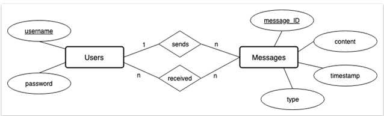
```
Source code : database-account.sql

```
create database waph_team;
 CREATE USER 'waph_team16'@'localhost' IDENTIFIED BY  'Pa$$w0rd';
 GRANT ALL ON waph.* TO 'waph_team16'@'localhost';
 ```

source code : database-data.sql

```
-- Create the users table
create table users(
 username varchar(50) PRIMARY KEY,
 password varchar(100) NOT NULL);
 INSERT INTO users(username,password) VALUES ('admin',md5('MyPa$$w0rd'));

-- Create the messages table
CREATE TABLE messages (
    message_ID INT PRIMARY KEY AUTO_INCREMENT,
    content TEXT,
    type VARCHAR(20),
    timestamp TIMESTAMP DEFAULT CURRENT_TIMESTAMP,
    sender_username VARCHAR(50),
    FOREIGN KEY (sender_username) REFERENCES users(username)
);

-- Create the sends relationship table
CREATE TABLE sends (
    message_ID INT,
    sender_username VARCHAR(50),
    PRIMARY KEY (message_ID),
    FOREIGN KEY (message_ID) REFERENCES messages(message_ID),
    FOREIGN KEY (sender_username) REFERENCES users(username)
);

-- Create the receives relationship table
CREATE TABLE receives (
    message_ID INT,
    receiver_username VARCHAR(50),
    PRIMARY KEY (message_ID, receiver_username),
    FOREIGN KEY (message_ID) REFERENCES messages(message_ID),
    FOREIGN KEY (receiver_username) REFERENCES users(username)
);

GRANT ALL ON messages TO 'waph_team16'@'localhost';
GRANT ALL ON sends TO 'waph_team16'@'localhost';
GRANT ALL ON receives TO 'waph_team16'@'localhost';
```

## User Interface

In the user interface it mainly concentrates on the logged in users Creating and setting up a database (may be unfinished and subject, to changes)
Users who are logged in have the ability to create a post and leave comments, on any existing Logged in users are allowed to modify (edit, delete) their own posts.

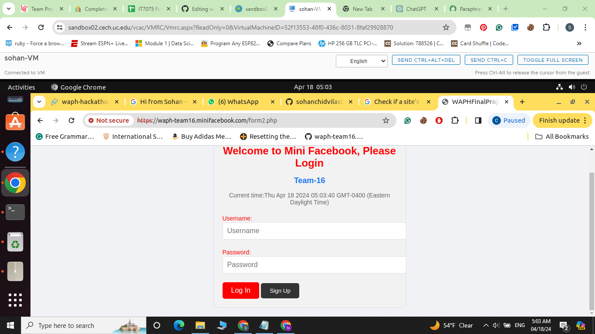

# Security analysis

We carried out a thorough security analysis in Sprint 2 in order to find potential weaknesses and put effective risk-reduction in place. We concentratedd on guaranteeing the platform-wide availability confidentiality and integrity of the front-data with the back-end data. This required putting encryption methods in place to safeguard private user data kept in the database, like passwords. To stop unwanted access to user accounts, we also implemented authentication procedures. Additionally, in order to reduce the danger of SQL injection and cross-site scripting (XSS) attacks, we included input validation and sanitization. In order to prevent session hijacking, we also used secure session management techniques. We also put in place appropriate access control mechanisms to guarantee that users may only view and edit their own data. Frequent penetration tests and security checks were carried out to find and fix any possible issues

# Demo (screenshots)

In this Sprint-2 we successfully designed the database and connected it with the front end with all the security ascpects

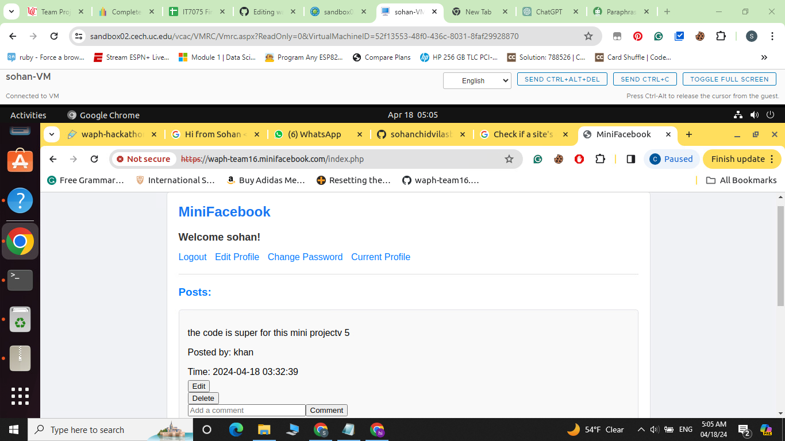

### Database design
The design is well aligned with tables.

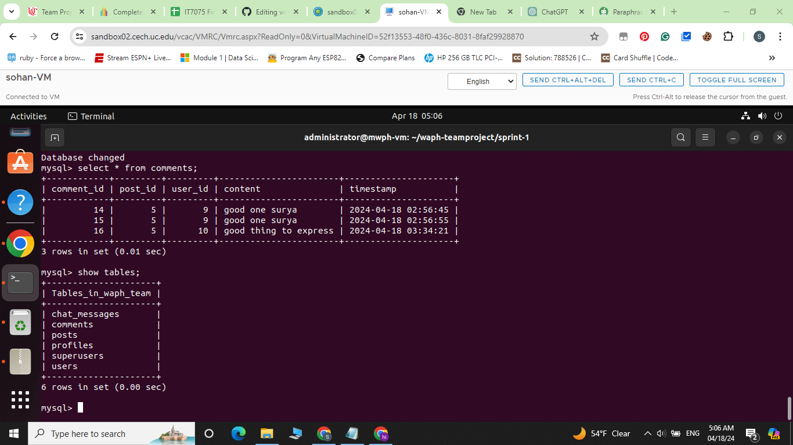

### Creation of posts
The users with autheticated log in can create posts and view other posts and can also comment on the posts.

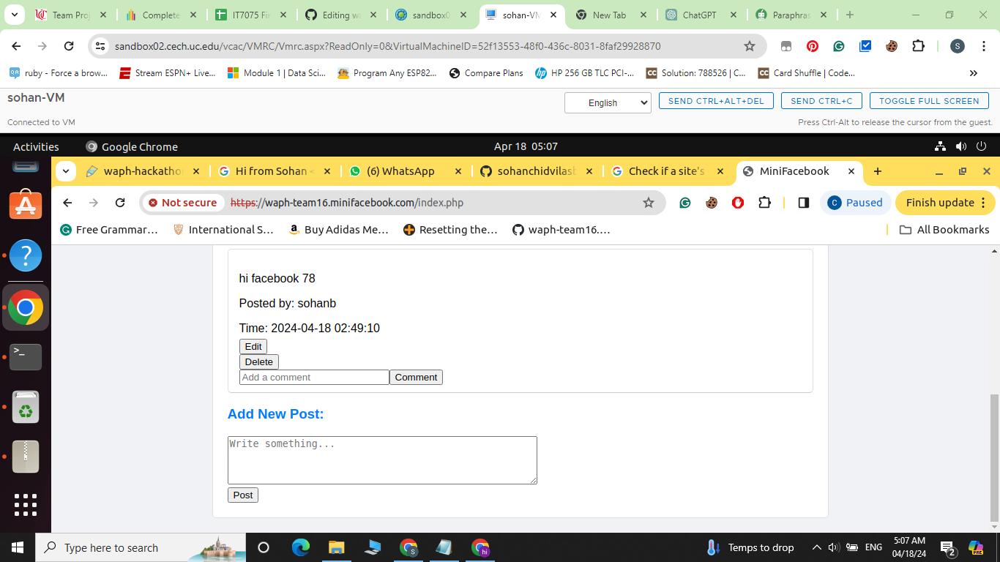

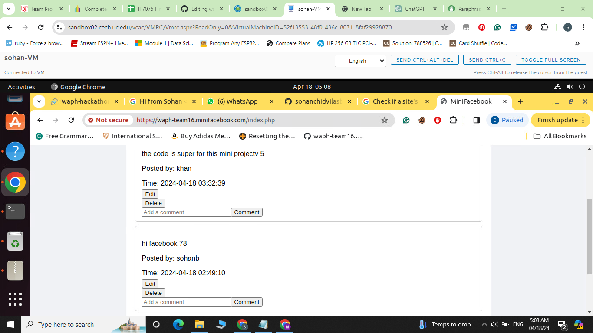

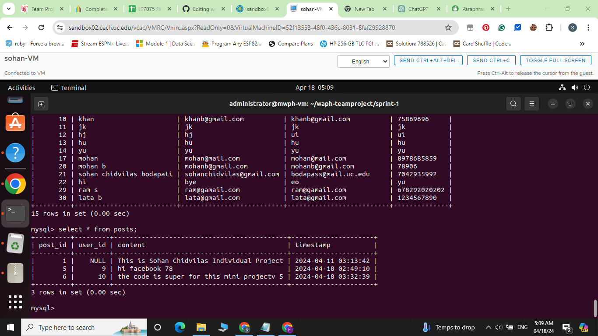

### Posts can be updated or deleted
In this section, we have implemented the task of editing the existing posts and they can also be deleted. Other posts can not be deleted or updated.

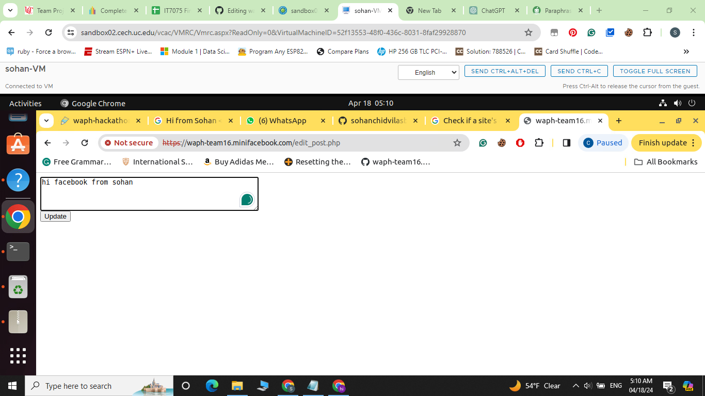


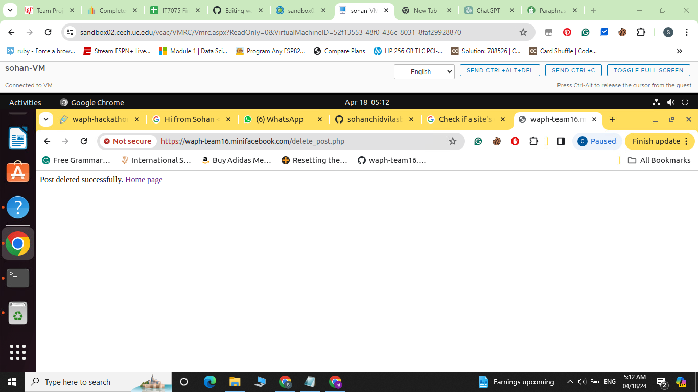

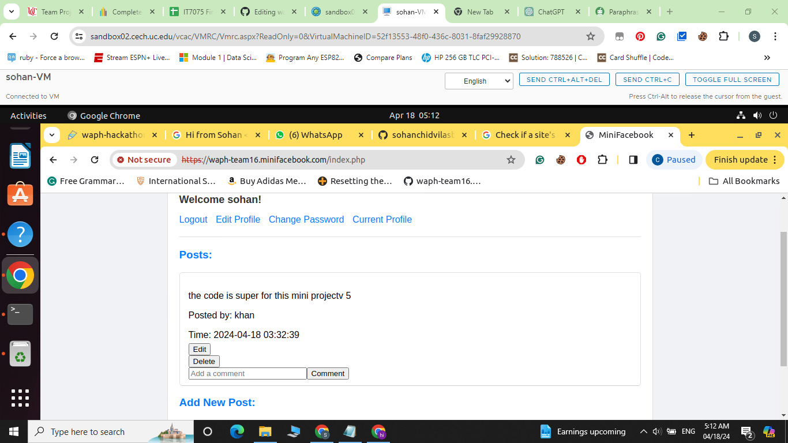

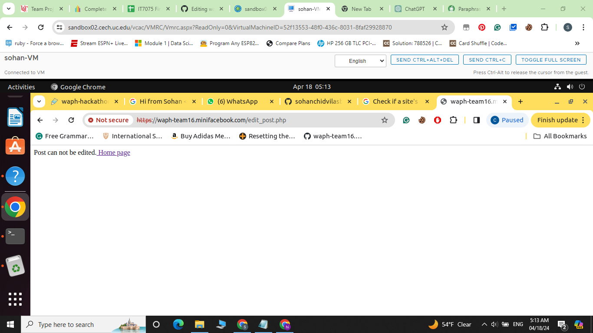


# Software Process Management

1. Sprint 2 mainly focused on database management with the front end.
2. Member-1 created the database configurations.
3. Member-2 The fronted CSS and connected it with the backend.
4. Member-3 The authentication and security factors were handled.


Result: We were on the mark with the result.

## Scrum process

### Sprint 2

Duration: 04/1/2024-04/18/2024

#### Completed Tasks: 

1. Github Setup
2. Database Setup
3. Login authentication system with addition and deletion of posts

#### Contributions: 

1. Member 1, 5 commits, 7 hours, contributed in database setup
2. Member 2, 7 commits, 8 hours, contributed in connection of post requests to front end
3. Member 3, 5 commits, 6 hours, contributed in security setup

#### Sprint Retrospection:

_(Introduction to Sprint Retrospection:

In Sprint 2 we assess our development and  areas that needed work. We celebrated the successful completion of the design and implementation of the database in addition to the addition of features for user engagement like the ability to add comments and articles. To improve security we did, however realise that permission and authentication systems still needed to be improved. We also found that optimissing database queries is crucial for increased scalability and performance. As we move forward, we want to give these areas top priority while staying committed to providing users with value through iterative development and continual improvement.


| Good     |   Could have been better    |  How to improve?  |
|----------|:---------------------------:|------------------:|
|Edit posts|with double factor authentication|         null  |

# Appendix

The database file is already attached
