# -waph-sohan
# WAPH-Web Application Programming and Hacking


## Instructor: Dr. Phu Phung

## Student

**Name**: Sohan Chidvilas Bodapati

**Email**: bodapass@mail.uc.edu

**Short-bio**: My key interests  are in ethical hacking and securing the Invisible Internet. 


## Repository Information

Repository URL: [https://github.com/sohanchidvilasbodapati/-waph-sohan.git](https://github.com/sohanchidvilasbodapati/-waph-sohan.git)

This repository belongs to Sohan which is private to store source codes practiced. 

### Overview of Individual Project 2
In this project, I have covered all the parts that I have learned right from the initial stage in this particular course. The full stack is being fully deployed in this project with a personal homepage rendering on HTML, CSS, JavaScript, and PHP where I have implemented all the techniques to overcome the attacks such as SQL injection attacks, XSS, session hijacking and CSRF. Connecting the web page to the database is a crucial task where it has had a great impact on the validation of input. This individual project is a building stone to the mini project and have learned a lot on full stack development. 

The link to the lab:
[https://github.com/sohanchidvilasbodapati/-waph-sohan/Individual_Project2](https://github.com/sohanchidvilasbodapati/-waph-sohan/tree/main/Individual_project2)

### Functional Requirements

### Registration Page:

* Customer Validation:
For validation checks such, as required fields, minimum and maximum lengths and specific patterns for input fields like email addresses you can utilize HTML5 form validation attributes such as required, pattern, minlength, maxlength, etc.
For advanced validation requirements that go beyond what HTML5 attributes can handle, such as verifying email addresses or enforcing password criteria consider implementing custom JavaScript validation to provide interactive feedback to customers.

* Server Side Validation:
To ensure the security and integrity of data it's important to validate input data on the server side even if client side validation fails or is bypassed.
Utilize a server-side programming language, like PHP to validate each input field according to predefined rules. For example ensure that email addresses and usernames are unique passwords meet security standards (length and complexity) and names contain only valid characters.

```
code: window.addEventListener('DOMContentLoaded', function()
{ var form = document.getElementById('registrationForm');
```
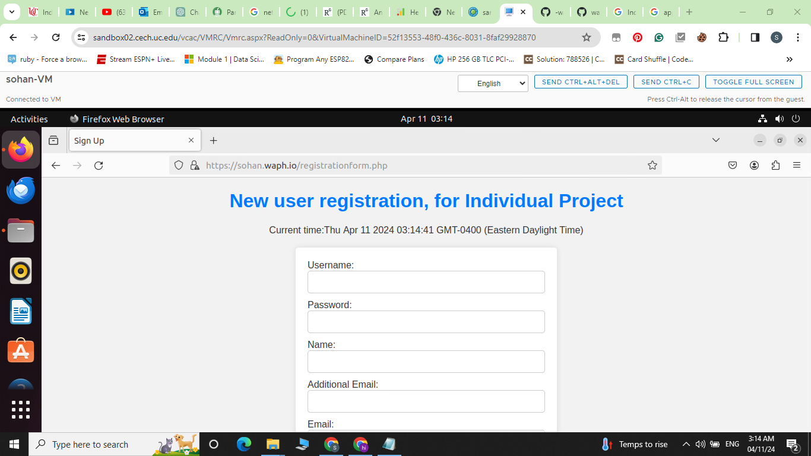

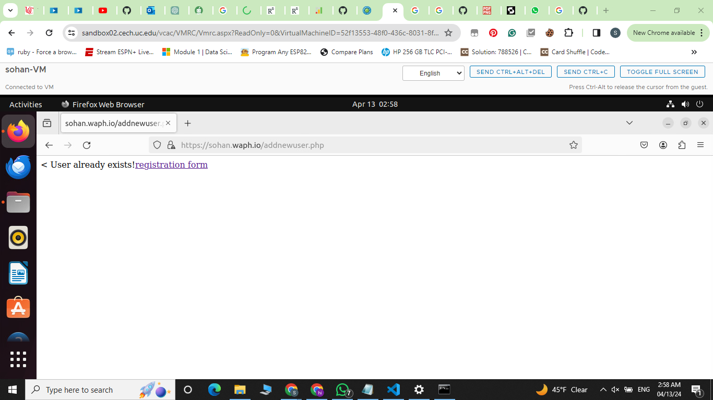

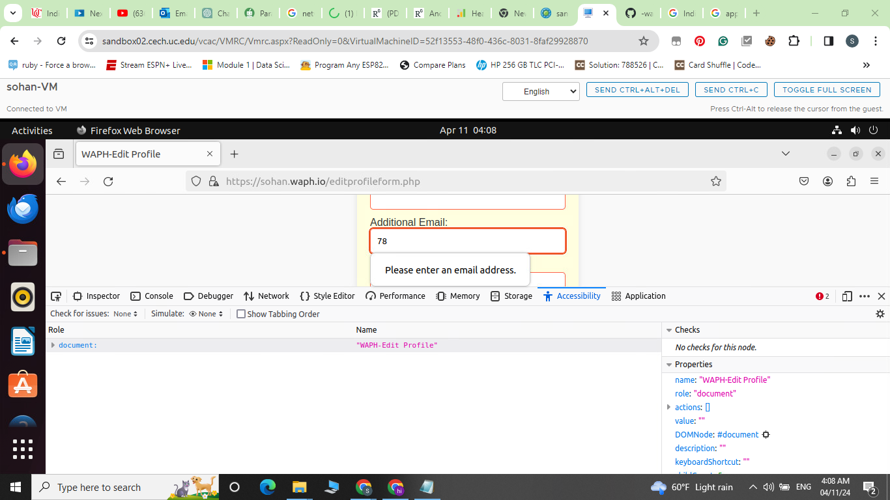

### Secure login page:

* Setting up the database: Establish a database where user details, like encrypted passwords, usernames and other necessary information can be stored securely.
* User Sign Up: Offer a form for individuals to complete for registration providing their password, username and any additional required data. For security measures ensure that passwords are hashed before storing them in the database.
* Design a login form for users to access by entering their username and password. Validate the provided credentials against the database records post submission.
* Managing Sessions: Develop a session for users post authentication and store user information in session variables (such, as user ID, username) to maintain user state while navigating across application pages.
* Access Control: Utilize access control methods to restrict users access, to sites or features based on their login privileges. For example if users try to access a website without logging in redirect them to the login page.
* Logout Functionality: Offer users the option to log out of an application by ending their session.
* Error Handling: I have Implemented error handling protocols to provide users with error messages if their login fails or other issues occur.
  
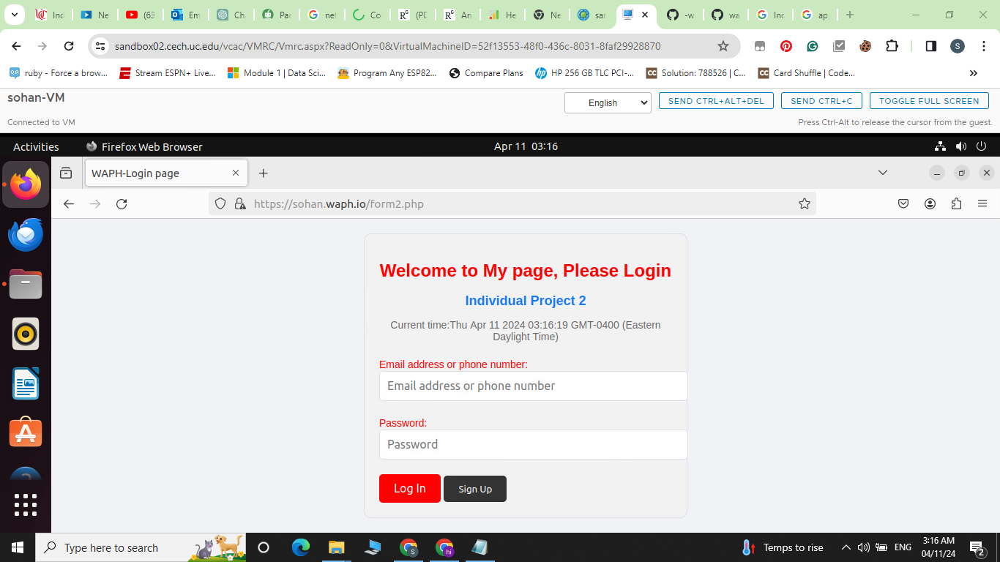

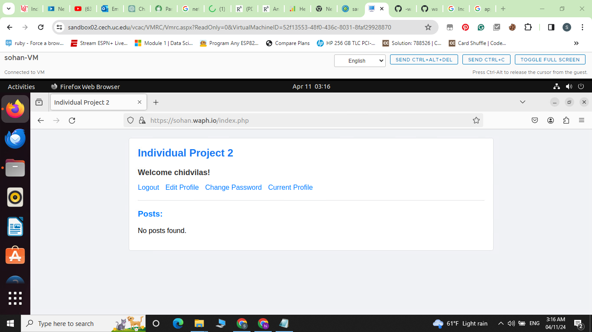

###  Profile Management:

* I have set up a profile page for users to view their information. I have also Included details such, as the users name, email address and any other relevant data on this page.
Additionally create a form that allows users to edit their details. I have Ensured that fields for the users email address, name and any other editable information are included in the form.
Database Interaction; When displaying the profile page retrieve the users profile data from the database using database queries. When a user submits changes through the edit profile form update the database with the modified information related to their profile.
Authentication: Remember to restrict access to the profile management feature to authorized users only. If users attempt to view their profile without logging in direct them to the login page.
Ensure that the user inputs data by performing validation tests on the edit profile form. To maintain data integrity validate email formats, set field length restrictions and conduct any validation tests.
Upon submission of the edit profile form provide users with feedback indicating whether their changes were successfully saved or if any issues occurred.
Finally I have Designed an user friendly interface for managing profiles to allow users to easily navigate and update their details.

```
code: $username = $_POST["username"];
$name = $_POST["name"];
$additional_email = $_POST["additional_email"];
$phone = $_POST["phone"];

```

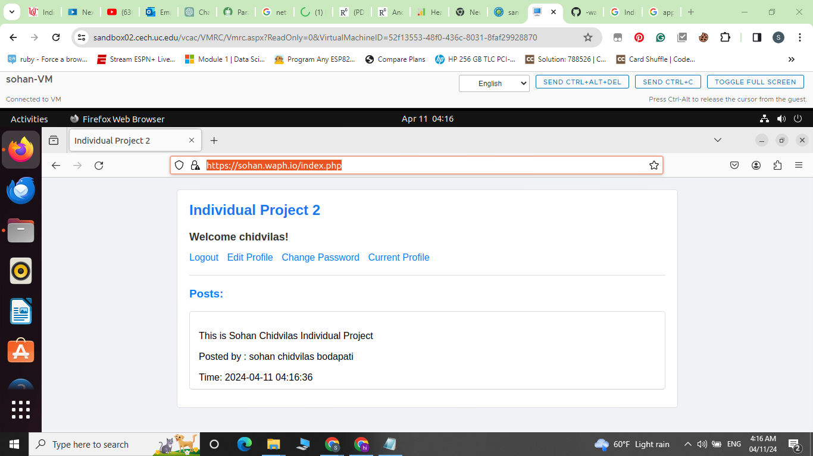

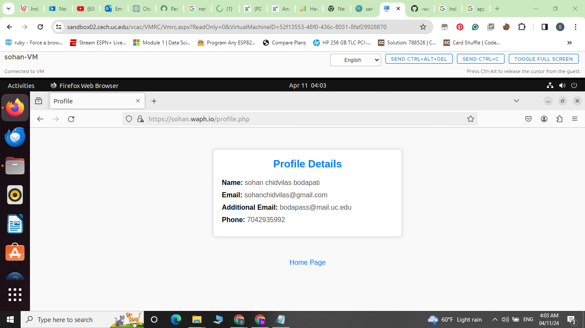

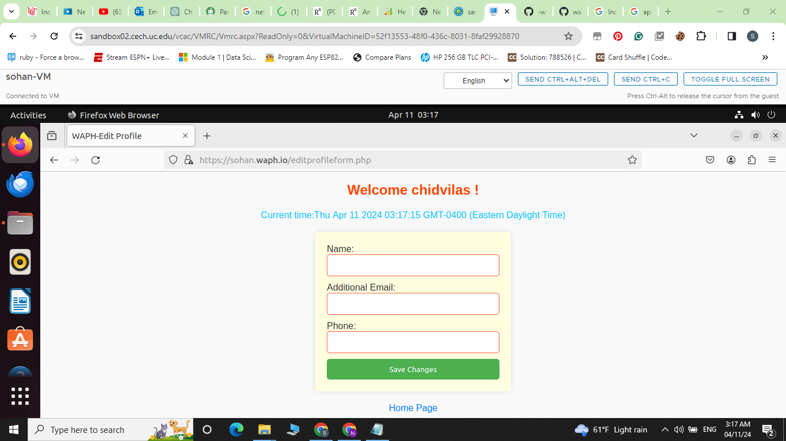

### Password update:

* I have created a form where users can input both their password and the new password they want to use for changing it with basic HTML and CSS along with javascript validation. To ensure accuracy lets include sections, for checking the password.
Validation: We need to run validation tests on the password change form to make sure that the user inputs meet all requirements. Lets verify that the new password meets any complexity criteria (, like minimum length or special character usage) and confirm that the current password is correct.
Authentication: Before allowing users to change their password lets ask them to enter their password as a way to confirm their identity. This extra step helps prevent individuals from modifying an accounts password.
Password Hashing: To securely encrypt the password we should utilize a robust hashing algorithm like bcrypt. This ensures that sensitive information remains protected.
Database Interaction: Once the request to change the password has been confirmed and verified, proceed to update the users password in the database, with the encrypted password.
Session Management To avoid any issues with session expiration make sure to update the users session if they are currently logged in to reflect the password modification.
Security Measures; I have Implemented security measures such as rate limitation to prevent brute force attacks on the functionality for changing passwords.I also have a provision of Logging

```
code:$stmt->bind_param("ss", $hashed_password, $username);
    $stmt->execute();
```

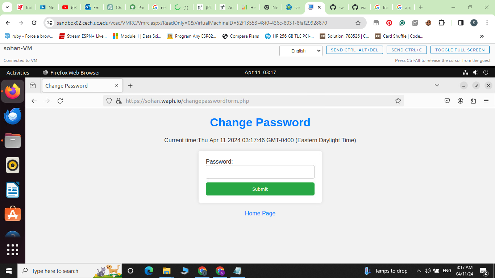

### Security and Non-technical Entities

### Security Implementations:

* I have Ensured the application is deployed using HTTPS to safeguard it against SQL attacks and XSS by encrypting the data transmitted between the users browser and your server.
Secure Password Handling; Prior to storing passwords in a database hash them utilizing a hashing method such as hashing using ```md5```. This practice conceals plaintext passwords in case of a database breach.
Avoid Using Root Account; Refrain from employing the MySQL root account within PHP scripts. Instead create a MySQL user with permissions necessary for operating your application. This approach minimizes damage in case of a security breach.
Utilize Prepared Statements; To prevent SQL injection attacks ensure that all database operations are carried out using statements. Prepared statements data, from SQL logic thereby thwarting access attempts.
Make sure to validate all user inputs, on the server side to ensure they meet the required lengths and formats. This helps in preventing threats, such as SQL injection and XSS (Cross Site Scripting).
* The function ```encodeURIComponent()``` is utilized to verify if the input length's zero. It also displays a message, for an user input. Moreover encodeURIComponent encodes the input data. Manages characters to prevent injection attacks. In the case of the guessAge function it validates whether the name is provided or empty prior, to initiating the API call. Using ```SSL``` keys ```HTTPSOnly = True``` which enables HTTPS server.
```
code: $hashed_password = md5($password);
```
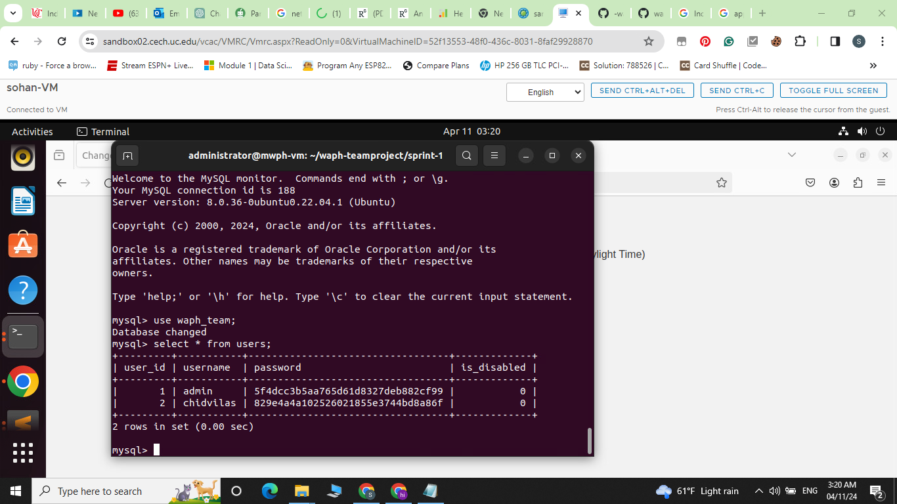

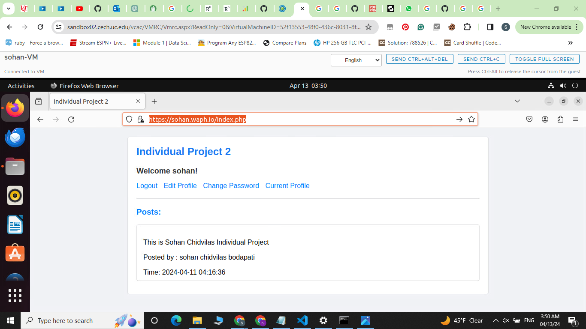

### Input Validation: 

* The validation is brought from JavaScript before proceeding with user provided data it involves validating and sanitizing the information to ensure it meets specified criteria regarding formats, lengths and restrictions. By implementing input validation on both the client and server sides, the risk of inputs that vulnerabilities in applications is minimized, thereby enhancing security.
Client side validation using JavaScript enables feedback to users when they input data. This feedback may include displaying error messages or highlighting input fields. However since client side validation can be tampered with or bypassed by adversaries relying on it is inadequate. Therefore server side validation plays a role, in ensuring data integrity and security measures are upheld.
Regardless of any validation done on the users end it's crucial to validate and clean up user inputs before proceeding with server side validation. This step is essential, for protecting the server against threats such as SQL injection and XSS attacks preventing inputs from reaching the server. Server side validation involves rejecting any input that doesn't meet the criteria ensuring that data aligns, with established rules and boundaries.
Web applications.
* Lets take a look, at the database. I've added some SQL code to showcase the tables in the database revealing its structure. By using the code provided in the URL you can see the outcome illustrated in the figure. This reveals all of the data, within the database to what's shown in the screenshot below.
* The logic below is all about the user validation from the database if the new user is registering with same username the below input validation works.
* ``` $stmt->bind_param("s", $username); ``` This is the main logic behind protection of SQL injections that I have implemented.
  
```
code: $result = $stmt->get_result();
    if ($result->num_rows >= 1)
        return TRUE;
    return FALSE;
```


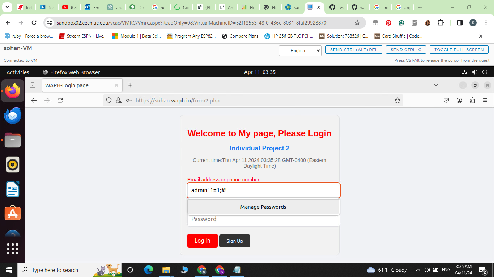

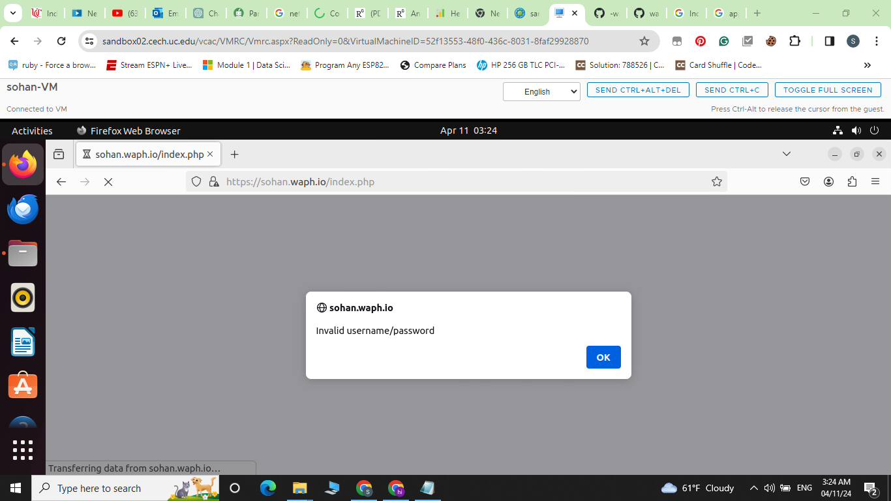


### Database:

I have designed the database's structure in a way to be aceesble with the passkey I have created ```Pa$$w0rd```. MySQL database have been configured to store user data while minimizing the risk of unauthorized access or data breaches. Describing the data model of the application correctly involves creating the tables, fields and connections. Interactions, with the database should adhere to secure practices, such as employing prepared statements and parameterized queries to prevent SQL injection attacks. Additionally sensitive information, like passwords should undergo hashing before being stored in the database.
```
code: $mysqli = new mysqli('localhost', 'waph_team16', 'Pa$$w0rd', 'waph_team');
```
```
email validation from the database.
    if (!filter_var($email, FILTER_VALIDATE_EMAIL)) {
        echo "Invalid email format!";
        echo '<a href="registrationform.php">registration form</a>';
        exit;
    }
```


### Development of Front-end: 

* Most of the front end codes like HTML, CSS and JavaScript are included inside the PHP files for storage optimization. Creating an engaging user experience involves utilizing HTML, CSS and JavaScript to develop an adaptable user interface. HTML establishes the structure of the interface defining components such, as buttons, forms and navigation menus. CSS is then used to style these elements ensuring consistency in appearance and layout across screen sizes and devices. Employing a CSS framework or template can streamline the design process. Enhance the appeal of the interface. JavaScript plays a role in enhancing user interaction by enabling functionalities like interactive menus form validation and real time content updates without necessitating page refreshes. Implementing client side validations, with HTML5 and JavaScript boosts usability by offering feedback on input errors thereby improving the user experience while reducing potential issues.

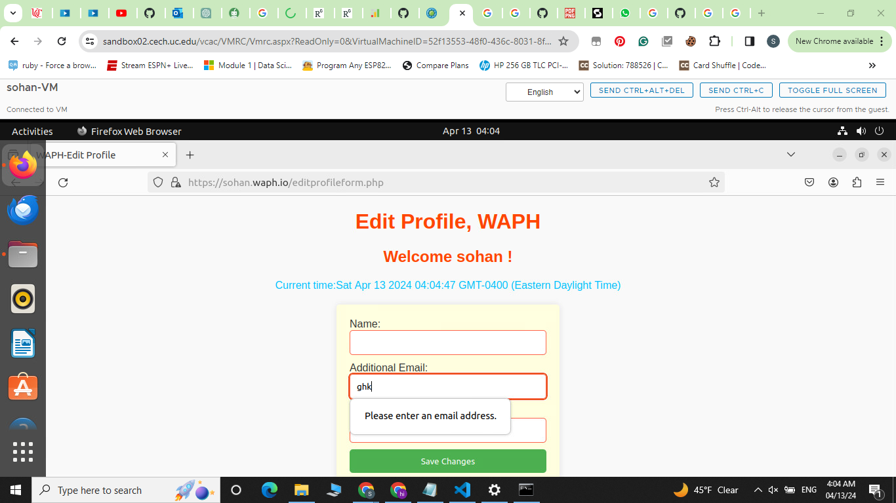

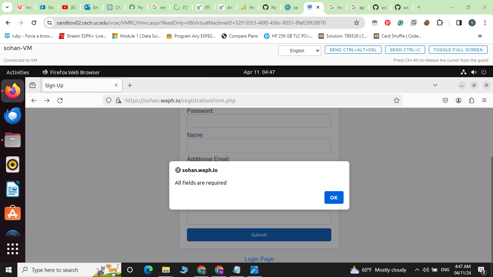

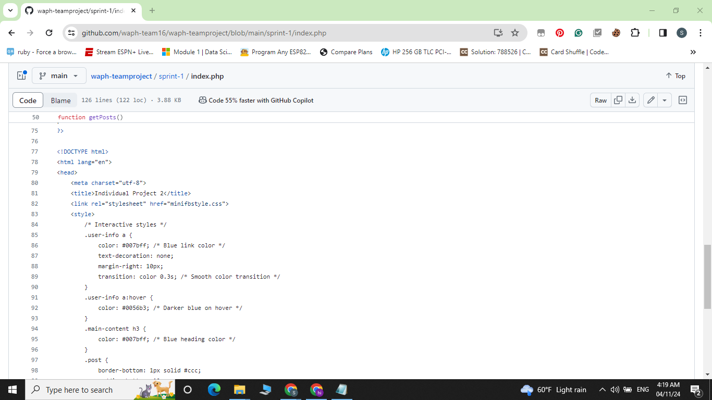

### Session Management to prevent Session Hijacking: 

* I have configured the SSL certificate to allow the website to operate on HTTPS and safeguard against session hijacking. By assigning ```$httponly = TRUE;``` we guarantee that session cookies are not retained, which boosts security. Moreover employing ```session_destroy();```assists, in thwarting cookie transfer, among browsers. Safeguarding information, such as user credentials and session identifiers from parties is achieved by effectively managing user sessions. To address vulnerabilities related to sessions measures such as sessions post user validation, employing session IDs generated using cryptographic techniques and securing communication between the server and client via HTTPS are necessary. Strengthening security further involves actions like ending sessions implementing secure session coookies with HTTPOnly and Secure attributes and storing session data securely on the server side.
* I can also check the cookie logs weather it is store or not. ``` cat /var/log/apache2/access.log ``` This gives us an idea wether the cookies are getting stored or not.

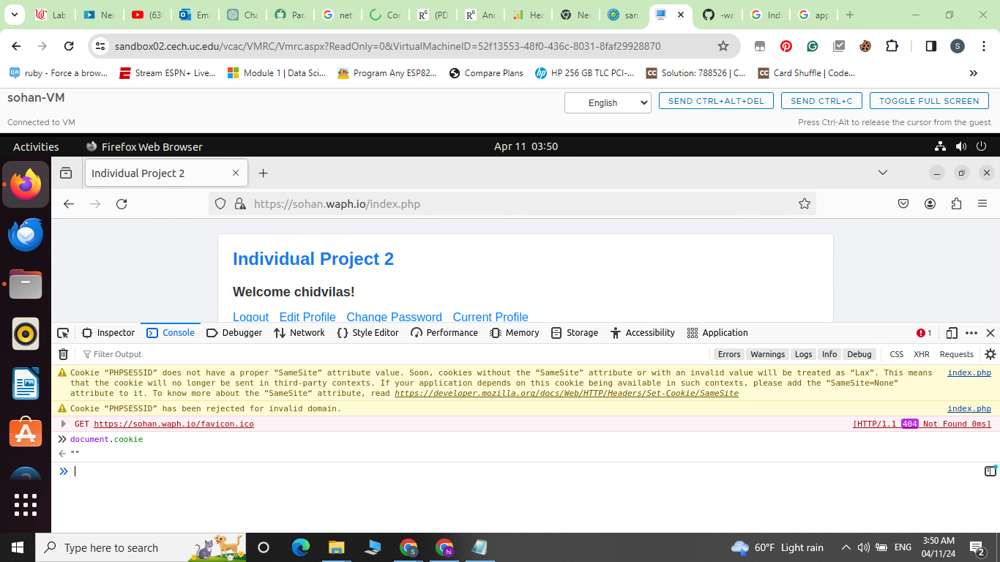

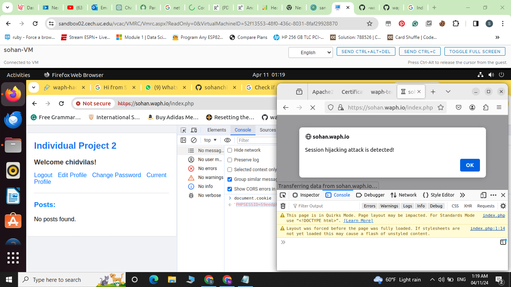

### CSRF Protection:

* I have used the CSRF tokens  to protect the application from Cross Site Request Forgery (CSRF) attacks. These tokens are unique to each user session. Are added to forms or requests. They are verified when submitted to ensure the request is valid. By requiring this token in database altering requests the application can effectively block CSRF attacks. Prevent actors from copying the token. Implementing strategies like SameSite cookie attributes and verifying the source of requests can further enhance the applications defenses against CSRF vulnerabilities.
* To limit cookies to work exclusively within the website hosting the web application you can include the 'SameSite' attribute. SameSite cookies help lower the chance of site request forgery (CSRF), by stopping browsers from sending cookies in requests originating from unrelated websites. Here's an illustration of input:  ```<input type="hidden" name="nocsrftoken" value="<?php echo $rand;"/> ```
* When developers set cookies with ``` 'SameSite=Strict' or 'SameSite=Lax' ``` it helps protect against security risks, like site request forgery by ensuring that sensitive cookies are not included in vulnerable requests. Additionally using custom headers can further enhance the security measures in place.
* 


### Video link: 
* [https://youtu.be/-Uq_pPPUSjM](https://www.youtube.com/watch?v=-Uq_pPPUSjM&ab_channel=SohanChidvilasBodapati)


